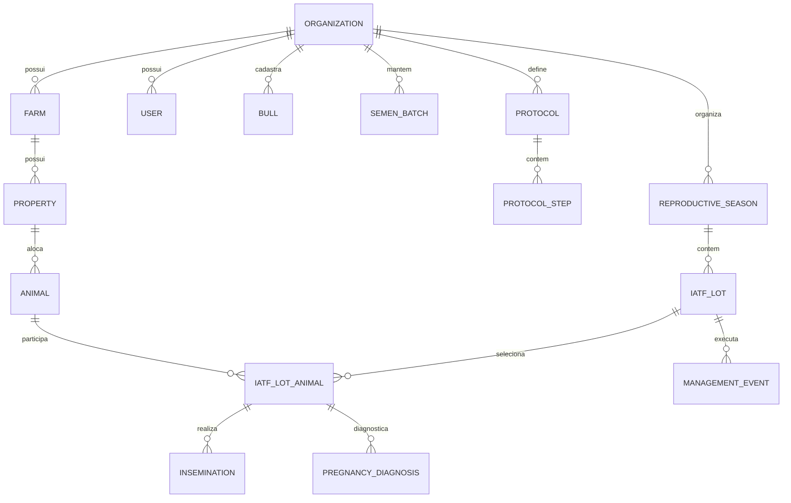

# DOMAIN MODEL — SISTEMA DE GESTÃO IATF (SUPABASE)

## 1. Visão Geral do Domínio

O sistema **IATF Management System** foi projetado para gerenciar operações de Inseminação Artificial em Tempo Fixo (IATF) e acompanhamento reprodutivo bovino de grande escala. O modelo de domínio é centrado em eventos operacionais, rastreabilidade individual de matrizes, protocolos hormonais configuráveis e acompanhamento multi-tenant por organização.

---

## 2. Entidades Principais e Conceitos de Negócio



---

## 3. Descrição das Entidades do Domínio

### 3.1. Organização (`Organization`)
- **Conceito**: Entidade raiz do conceito multi-tenant. Representa uma empresa pecuária, grupo ou veterinário responsável por múltiplas fazendas.
- **Responsabilidade**: Isolamento total de dados, controle de assinatura e permissões.

### 3.2. Fazenda e Propriedade/Retiro (`Farm` & `Property`)
- **Farm**: Unidade geográfica principal (ex: *Fazenda Boi Gordo*).
- **Property/Retiro**: Divisão operacional ou pasto/retiro dentro da fazenda (ex: *Retiro 01*).

### 3.3. Matriz / Animal (`Animal`)
- **Conceito**: Representa a fêmea bovina (matriz, novilha, vaca parida, vaca solteira).
- **Identificação**: Brinco / Marcação visual (única dentro da propriedade).
- **Atributos Reprodutivos**: Raça, Categoria (Novilha, Primípara, Secundípara, Multípara), Data de Nascimento/Idade, Status Reprodutivo (Vazia, Inseminada, Prenha, Descarte).

### 3.4. Touro (`Bull`)
- **Conceito**: Reprodutor cadastrado para utilização em IA.
- **Atributos**: Nome do Touro, Código/Registro, Raça, Proprietário/Central.

### 3.5. Estoque de Sêmen / Partida (`SemenBatch`)
- **Conceito**: Partida/lote específico de palhetas de sêmen de um determinado touro.
- **Controle**: Quantidade comprada, quantidade utilizada, perdas e saldo em estoque.

### 3.6. Insumos e Dispositivos (`Medication` & `Device`)
- **Medication**: Medicamentos hormonais (Benzoato de Estradiol, PGF2a Cloprostenol, eCG, Cipionato de Estradiol).
- **Device**: Dispositivo intravaginal de progesterona (P4) com controle de reutilização (1º uso, 2º uso, 3º uso) e descarte.

### 3.7. Protocolo Reprodutivo (`Protocol` & `ProtocolStep`)
- **Protocol**: Modelo de manejo hormonal (ex: *Protocolo 01 — 3 Manejos*).
- **ProtocolStep**: Etapas do protocolo com offset em dias em relação ao D0:
  - **D0**: Aplicação de Benzoato + Inserção de Implante P4 (Offset 0 dias)
  - **D7**: Aplicação de PGF2a (Offset +7 dias)
  - **D9**: Retirada do Implante + eCG + Cipionato (Offset +9 dias)
  - **IA**: Inseminação Artificial (Offset +11 dias — 48h a 54h após D9)
  - **DG**: Diagnóstico de Gestação (Offset +44 dias — 30 a 35 dias após IA)

### 3.8. Estação Reprodutiva (`ReproductiveSeason`)
- **Conceito**: Período reprodutivo anual (ex: *Estação 2025/2026*). Agrupa todos os lotes de IATF realizados na safra.

### 3.9. Lote de IATF (`IATFLot`)
- **Conceito**: Agrupamento operacional de matrizes submetidas ao mesmo protocolo na mesma data de início (D0).
- **Propriedades**: Código do Lote, Data D0, Fazenda, Retiro, Protocolo Associado, Veterinário Responsável.

### 3.10. Matriz do Lote (`IATFLotAnimal`)
- **Conceito**: Associação N:M entre `Animal` e `IATFLot` para um ciclo específico.
- **Estado do Ciclo**: ECC na IA, Touro Utilizado, Partida do Sêmen, Inseminador, Diagnóstico de DG, ECC no DG, Previsão de Parto.

### 3.11. Manejo Operacional (`ManagementEvent`)
- **Conceito**: Evento de campo executado para o lote em uma data e horário específicos.
- **Atributos**: Etapa (D0, D7, D9, IA, DG), Data Planejada, Data Realizada, Horário Início, Horário Fim, Quantidade de Animais Trabalhados, Responsável, Perdas de Insumos.

### 3.12. Inseminação Artificial (`Insemination`)
- **Conceito**: Registro imutável do ato de inseminação de uma matriz específica.
- **Atributos**: Data/Hora, Touro, Partida de Sêmen, Inseminador, ECC no momento da IA.

### 3.13. Diagnóstico de Gestação (`PregnancyDiagnosis`)
- **Conceito**: Registro da ultrassonografia/palpação para verificação do resultado reprodutivo.
- **Resultado**: Prenha, Vazia, Inconclusivo.
- **Derivações**: Se Prenha -> Previsão de Parto = Data IA + 295 dias.

---

## 4. Ciclo de Vida da Matriz no Ciclo IATF

```text
[ Seleção para Lote ]
         │
         ▼
     [ D0: Implante P4 + BE ]
         │
         ▼
     [ D7 / D9: Manejo + Retirada P4 ]
         │
         ▼
     [ IA: Inseminação Artificial ] ── (Registra Touro, Sêmen, Inseminador, ECC)
         │
         ▼
     [ DG: Ultrassonografia ]
        ├── Prenha ──────► (Calcula Previsão de Parto = Data IA + 295 dias)
        └── Vazia ───────► (Elegível para Reagrupamento / RESSIA / Repasse)
```
